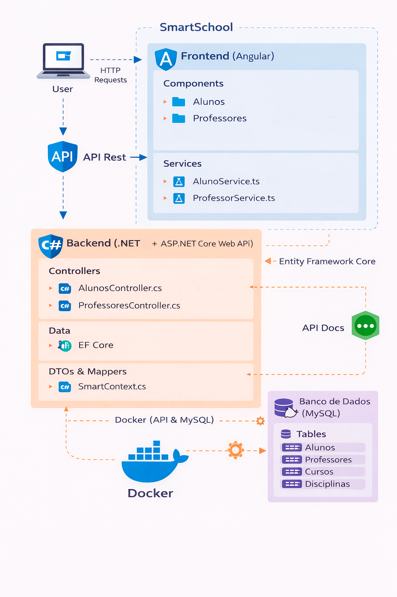

# 🎓 SmartSchool API

Sistema **full-stack para gerenciamento escolar**, desenvolvido com **.NET 8 Web API** no backend e **Angular 10** no frontend.

O projeto simula um ambiente real de aplicação educacional.
---

# 📌 Objetivo

Demonstrar na prática:

- Construção de uma API RESTful estruturada  
- Aplicação de boas práticas com **DTOs** e **Repository Pattern**  
- Paginação, filtros e organização de dados  
- Integração entre backend (**.NET**) e frontend (**Angular**)  
- Estrutura escalável e preparada para evolução  

---

# 🚀 Tecnologias Utilizadas

## 🔙 Backend (.NET 8)

- ASP.NET Core Web API  
- Entity Framework Core  
- MySQL (via Docker)  
- AutoMapper  
- DTOs (Data Transfer Objects)  
- Repository Pattern  
- Paginação customizada  
- Swagger (documentação da API)  

## 🔜 Frontend (Angular 10)

- Angular  
- TypeScript  
- HttpClient  
- RxJS  
- Arquitetura baseada em Services  
- Consumo de API REST  

---

# 🧩 Estrutura do Projeto

## 🔙 Backend

```bash
SmartSchoolAPI
│
├── Data
│   └── Contexts (DbContext)
│
├── Repositories
│   ├── Interfaces
│   └── Implementations
│
├── Models
│
├── DTOs
│
├── Controllers
│
├── Helpers
│   └── Paginação e Extensões
│
└── Profiles
    └── AutoMapper
```

## 🔜 Frontend

```bash
SmartSchoolApp
│
├── components
│   ├── alunos
│   ├── professores
│   └── dashboard
│
├── models
│
└── services
    ├── aluno.service.ts
    └── professor.service.ts
```

---

# 🗺️ Arquitetura




---

# 🔄 Fluxo de Funcionamento

## Exemplo: Busca de alunos com paginação

```text
Frontend:
AlunoService.getAll(page, itemsPerPage)

↓ HTTP

GET /api/alunos?pageNumber=1&pageSize=10

↓ Backend

Controller recebe a requisição

↓
Repository aplica paginação

↓
Headers retornam metadata

↓ Frontend

Leitura do header Pagination

↓
Montagem de PaginatedResult

↓
Exibição na interface
```

---

# 📦 Modelagem do Sistema

## Entidades principais

- Aluno  
- Professor  
- Disciplina
- Curso

## Relacionamentos

- Aluno ⇄ Disciplina (**N:N**) → `AlunoDisciplina`  
- Aluno → Curso (**1:N**)  
- Professor → Disciplina (**1:N**)  

---

# 🌱 Seed de Dados

O sistema já inicia com dados pré-cadastrados.

*Exemplo de alguns cadastros.*

## Professores

- Lauro Oliveira  
- Roberto Soares  
- Fernanda Silva  

## Cursos

- Tecnologia da Informação  
- Sistemas de Informação  
- Ciência da Computação  

## Disciplinas

- Matemática  
- Programação  
- Banco de Dados  

## Alunos

- Marta Kent  
- Paula Isabela  
- Lucas Machado  

---

# 🌐 Endpoints Principais

## Alunos

```http
GET    /api/alunos
GET    /api/alunos/byId/{id}
GET    /api/alunos/ByDisciplina/{id}
POST   /api/alunos
PUT    /api/alunos/{id}
PATCH  /api/alunos/{id}
PATCH  /api/alunos/{id}/trocarEstado
DELETE /api/alunos/{id}
```

## Professores

```http
GET    /api/professor
GET    /api/professor/byId/{id}
GET    /api/professor/byaluno/{alunoId}
POST   /api/professor
PUT    /api/professor/{id}
PATCH  /api/professor/{id}
DELETE /api/professor/{id}
```

---

# ⚙️ Funcionalidades Implementadas

- CRUD completo (Aluno e Professor)  
- Paginação com metadata em header  
- Filtro por disciplina  
- Relacionamentos N:N  
- DTOs para proteção de dados  
- AutoMapper para conversão de objetos  
- Troca de estado ativo/inativo  
- Integração completa com Angular  
- Arquitetura escalável  

---

# 🐳 Docker

A aplicação pode ser executada com Docker, incluindo:

- API .NET  
- Banco MySQL  

---

# 📄 Licença

Projeto desenvolvido para fins de estudo e portfólio.

---

# ⭐ Considerações Finais
Projeto desenvolvido com foco em boas práticas, organização em camadas e integração entre backend e frontend, simulando uma estrutura próxima de aplicações utilizadas no mercado.
